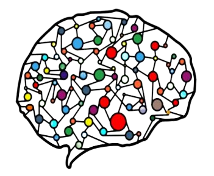

<link rel="stylesheet" href="https://unpkg.com/leaflet@1.7.1/dist/leaflet.css"
   integrity="sha512-xodZBNTC5n17Xt2atTPuE1HxjVMSvLVW9ocqUKLsCC5CXdbqCmblAshOMAS6/keqq/sMZMZ19scR4PsZChSR7A=="
   crossorigin=""/>

 

# Welcome to DataScIIEnce

    

## About

Welcome to the **DataScIIEnce** official GitHub webpage, which centralizes the different projects, sessions materials and snippets useful for Machine Learning and Data Analysis.

**DataScIIEnce** is the Data science, Machine & Deep learning student club of **ENSIIE Paris**, French engineering school specialized in applied mathematics, high-performance computing and computer science.

## Who are we ?

We are a group of student passionate about **Data science**, **Machine learning** and **Deep Learning** applied to various industrial use cases.

## Where are we ?

We are situated in our *French* engineering school : **ENSIIE Paris**[^1]. at Évry-Courcouronnes, France.

[^1]: ENSIIE is standing for *École Nationale Supérieure d'Informatique pour l'Industrie et l'Entreprise*.

## Follow us

You can use these networks to stay in touch with our team, follow our activities and share your interest with people deeply involved in the community.

- [LinkedIn](https://www.linkedin.com/company/datasciience)
- [Instagram](https://instagram.com/datasciience_club)
- [GitHub](https://github.com/DataScIIEnce-ENSIIE/)
- [Website](https://datasciience.iiens.net/)

---

You can also contact us via email at the following address :

Email : 

<button onclick="document.getElementById('email').innerHTML = '<a>datasciience@gmail.com</a>';" id="show-email">Show email address</button>
